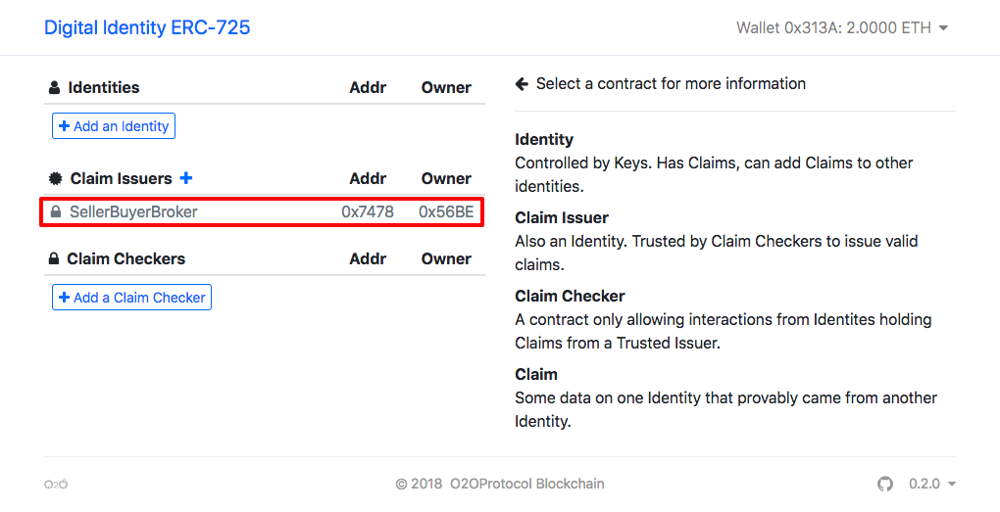
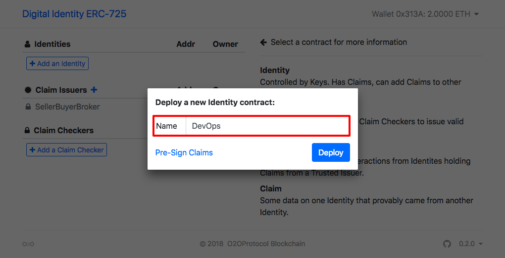
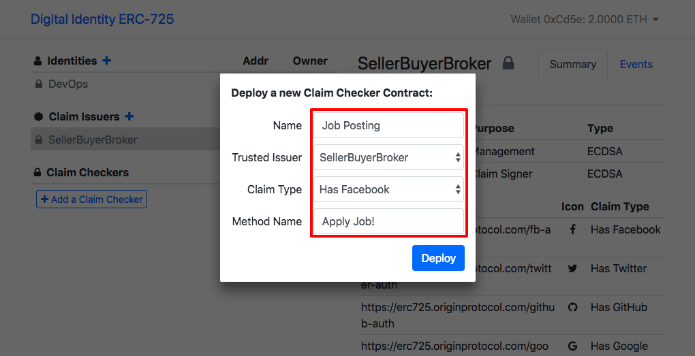
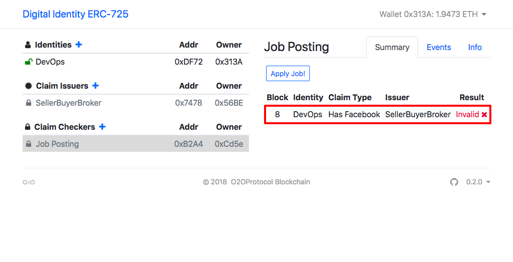
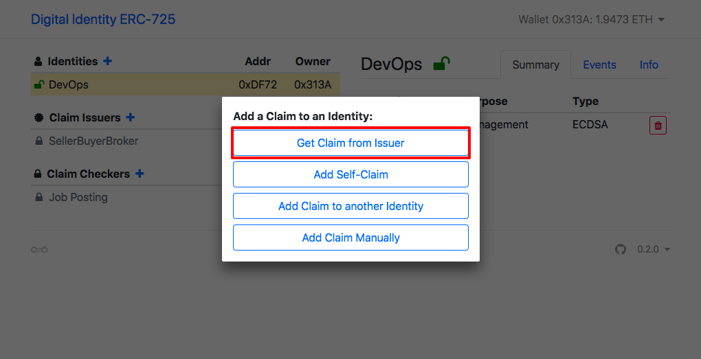
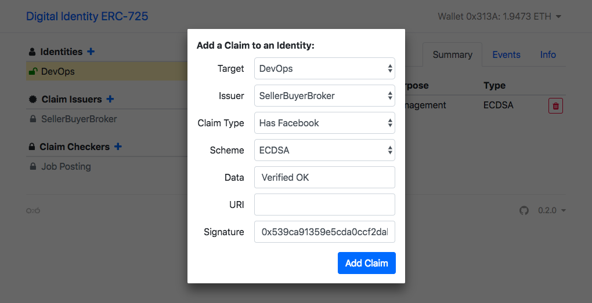
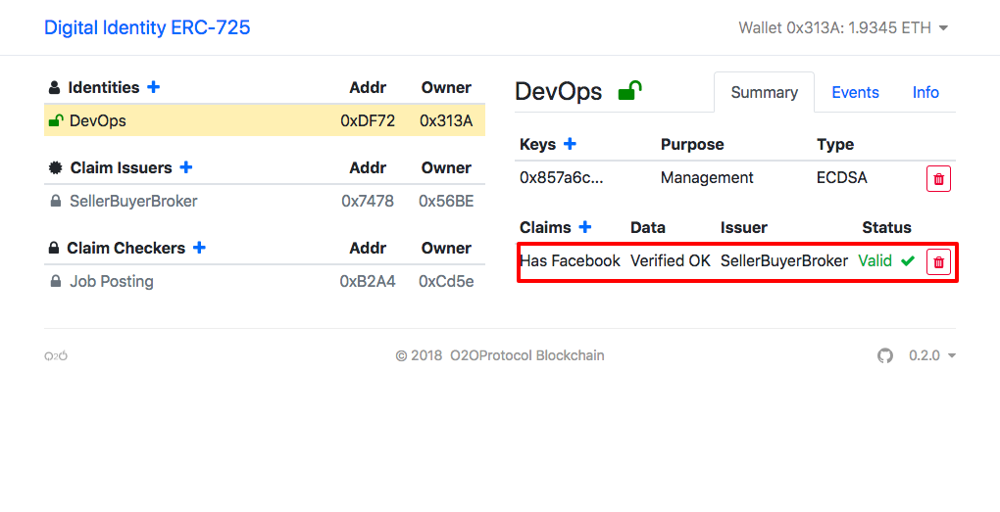
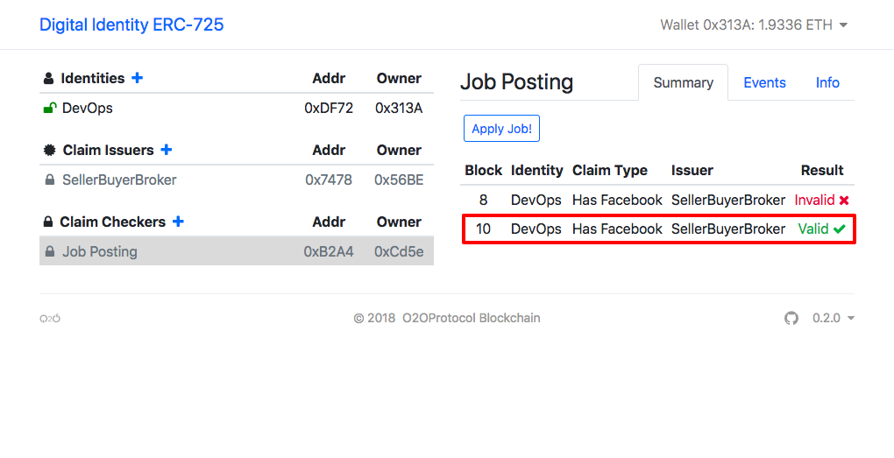

# Digital-Identity using ERC 725/735

An implementation of [ERC 725](https://github.com/ethereum/EIPs/issues/725) and [ERC 735](https://github.com/ethereum/EIPs/issues/735), proposed standard for managing **Digital Identity** on the **Blockchain**. We uses the [Truffle framework](http://truffleframework.com/) and [Ganache CLI](https://github.com/trufflesuite/ganache-cli) for testing.

Using [ERC 725](https://github.com/ethereum/EIPs/issues/725), a **Smart Contract** can protect function calls from being executed unless the **Sender** has a verified **Claim** from a trusted **Issuer**; e.g. build a mechanism into our Smart Contracts to only allow interactions from reputable people. ERC-725 allows for many more use-cases, such as multi-sig execution approvals and verification by contract call instead of key validation.

> **Default Mnemonic**: `logic cradle area quality lumber pitch radar sense dove fault capital observe` 

## Architecture

the class diagram to make extensive use of Solidity patterns for modular code i.e. libraries, abstract contracts and multiple inheritance:

```
                +--------------+         +------------+
                |              |         |            |
                |    ERC 165   |         | KeyStore** |
                |              |         |            |
                +---+--------+-+         +----+-------+
                    |        |                |
               +----v-----+ +v---------+ +----v-----+
               |          | |          | |          |
 +-------------+ ERC 735* | | ERC 725* | | KeyBase* |
 |             |          | |          | |          |
 |             +----------+ ++-+----+--+ +--+-------+------+--------------+
 |                           | |    |       |              |              |
 |                           | |    |       |              |              |
 |   +-----------------------+ |    | +-----+-----+  +-----v-----+ +------v-------+
 |   |                         |    | |           |  |           | |              |
 |   |                 +-------|----|-+  Pausable |  | KeyGetter | | Destructible |
 |   |    +--------------------|----|-+           |  |           | |              |
 |   |    |            |       |    | +--+--------+  +-+---------+ +--+-----------+
 |   |    |            |  +----+    |    |             |              |
 |   |    |            |  |         |    |             |              |
 |   |    |            |  |         |    |             |              |
 |   |    |            |  |         |    |             |              |
+v---v----v---+ +------v--v---+  +--v----v--+          |              |
|             | |             |  |          |          |              |
|ClaimManager | | KeyManager  |  | MultiSig |          |              |
|             | |             |  |          |          |              |
+---+---------+ ++------------+  +--+-------+          |              |
    |            |                  |                  |              |
    |            |                  |                  |              |
    |            |        +---------v------------------v---+          |
    |            |        |                                <----------+
    |            +-------->            Identity            |
    |                     |        (ERC 725 + 735)         |
    +--------------------->                                |
                          +--------------------------------+

* = Abstract contract
** = Library
```
  
## Local Development

> NVM & Yarn
```              
nvm install v9.11.1   &&
curl -sS https://dl.yarnpkg.com/debian/pubkey.gpg | sudo apt-key add - &&
echo "deb https://dl.yarnpkg.com/debian/ stable main" | sudo tee /etc/apt/sources.list.d/yarn.list &&
sudo apt-get update && sudo apt-get install yarn
```

> Installation
```
  # 
  git clone https://github.com/o2oprotocol/digital-identity &&
  cd digital-identity                                       &&
  nvm use v9.11.1 && yarn install
```

> Run
```
  nvm use v9.11.1 &&
  yarn clean &&
  yarn start
```

> Tests
```
  yarn test 
```


## Live Demo

- [x] http://digital-identity.o2oprotocol.com
- [x] Certifiers provides Issuer-Services: 
  - [x] Has Phone
  - [x] Has Email
  - [x] [Facebook](https://developers.facebook.com/)
  - [x] [Linked-in](https://developer.linkedin.com/)
  - [x] [Google](https://console.cloud.google.com/apis/credentials)
  - [x] [Github](https://github.com/settings/developers)
  - [x] [Twitter](https://apps.twitter.com/) 
  

> **Demo Scripts**

Imagine we want to deploy a **Listing Contract** (e.g. post a job to hire a Freelancer), but only allow interactions from **Users** (e.g. Developers) with a verified `Has Facebook` & `Has Github`. How can we accomplish this with Digital Identity ERC-725?

> First, lets define the entities that will be interacting:
* The _Consumer:Developer_ is an identity who wants to apply a posted job.
* The _Issuer:SellerBuyerBroker_ is an identity which issues claims of type `FACEBOOK_VERIFIED` &  `GITHUB_VERIFIED`. *Note*: Buyer-Broker is HeadHunter.
* The _Listing:JobPosting_ will only allow _Consumer:Developer_ with `FACEBOOK_VERIFIED` &  `GITHUB_VERIFIED` claims from an _Issuer-HeadHunterService_ they trust.

> Second, _Consumer:Developer_ interact with a O2OIssuer/SellerBuyerBroker Listing Contract by following process:

1. _Buyer:Employer_ deploys a new **Identity Contract** (or reuses one they deployed earlier).
2.  _Buyer:Employer_ visits O2OIssuer/SellerBuyerBroker/verify and obtains a cryptographic signature proving that they control a particular `email` and `phone-number`.
3.  _Buyer:Employer_ adds this `Claim` to their `Identity Contract`.
4.  _Buyer:Employer_ tries to *apply a job* via a O2OIssuer/SellerBuyerBroker `Listing Contract`.
5.  `Listing Contract` looks at _Buyer:Employer_’s `Identity` for a `Claim` issued by O2OIssuer/SellerBuyerBroker.
6.  `Listing Contract` recovers the public key from the `Claim Signature` and verifies it is still valid on the O2OIssuer/SellerBuyerBroker `Issuer Contract`.
7.  Transaction is allowed to proceed.

Now that the _Buyer:Employer_ has a verified claim on their identity from O2OIssuer/SellerBuyerBroker, they can interact with any other contracts also accepting claims issued by O2OIssuer/SellerBuyerBroker.

### Troubleshooting

- Chrome > Console: `localStorage.clear();`
- Chrome > URL: `chrome://settings/siteData` 

## References:

- [Verifiable Claims Use-Cases](https://w3c.github.io/vc-use-cases/#user-needs)
- [blockcerts-revocation](https://github.com/WebOfTrustInfo/rebooting-the-web-of-trust-fall2017/blob/master/final-documents/blockcerts-revocation.pdf)


## Demo Walkthrough

1. Screen upon loading: first Wallet-ID `0x313A` for a person who desires a blockchain identity (_Consumer:Developer_).



2. Click "Add an Identity" and deploy an identity contract with name "DevOps".



You can see the address of the Contract, as well as the Wallet-ID of the Owner. 

3. Switch the active wallet to the second, `0x56BE`, for the role of a service that can verify `Has Facebook` or `Has GitHub` (_Issuer:SellerBuyerBroker_).

Again, you should see the address of this Contract, and the Wallet-ID of the Owner of this Contract. 

4. Switch the active wallet to the third, `0xCd5e` for the role to restrict access to only people with verified Facebook/Github accounts. (A marketplace for developers)

5. Click "Add a Claim Checker" and deploy a contract called "Job Posting" with certifier of `Has Facebook`. This is the contract which will be limited to interacting to people with verified Facebook accounts. 



6. Switch to the first Wallet, belonging to "DevOps" then Click on the `Apply Job!` Listing Contract. After clicking on "Check Claim", you should see that the claim is returned as **ClaimInvalid**. At this point, `DevOps` has no proof that has a Facebook account. 



7. In right column, you should see the `Add Claim` by our "SellerBuyerBroker" Certifier  that has a Facebook account. Click "Approve" to accept this claim to Alice's identity. 





`DevOps now has on-chain proof of `Facebook`!



8. Now click the `Job Posting` Listing Contract under `
Claim Checkers`, and then click on `Apply Job!` then `Check Claim`; You should see that this claim is returned as **ClaimValid***. 



`DevOps` is ready to start doing Blockchain Freelancer Marketplace!

===
